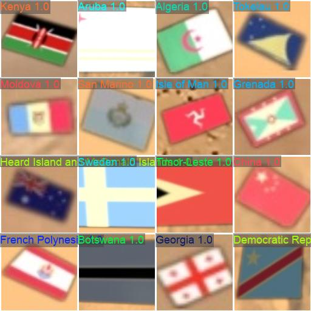
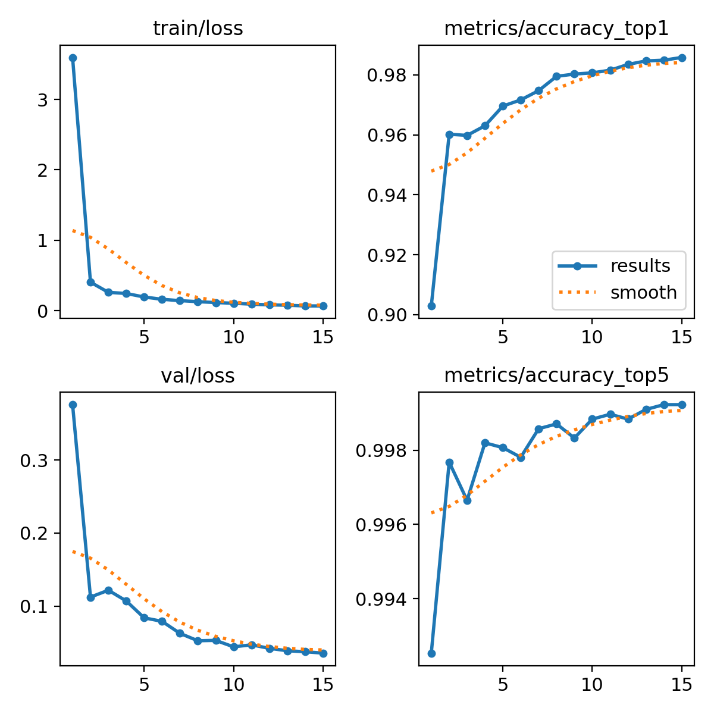

# Standalone Flag Classification Pipeline (YOLOv8s-cls)

[](https://www.python.org/)
[](https://github.com/ultralytics/ultralytics)
[](LICENSE)

This repository contains the standalone, end-to-end machine learning pipeline for generating datasets, training a `yolov8s-cls` image classifier on Kaggle T4 GPU, and validating classification accuracy. The model acts as a rigorous second-stage verification filter for flag object detectors, classifying crops into **296 unique categories** (plus a balanced `background` class) using full flag names.

---

## 📊 Model Performance

| Metric | Value | Details |
| :--- | :--- | :--- |
| **Validation Top-1 Accuracy** | **98.58%** | Classifying the exact country/institution or background crop |
| **Validation Top-5 Accuracy** | **99.92%** | True class is within the model's top 5 predictions |
| **Final Validation Loss** | **0.0354** | Cross-entropy loss on validation split |
| **Inference Speed** | **16.9 ms** | CPU inference latency per proposal crop |

---

## 🚀 Key Features

- **Dynamic Dataset Splitting**: Splits and structures the public 296-class cropped flag dataset (`mariamzakaria14/new-dataset-updated-296-cropped-mergedd`) directly in the Kaggle container using fast symbolic links.
- **Background Negative Integration**: Automatically symlinks a balanced subset of background/negative patches to prevent false positives and filter out non-flag proposals.
- **Training Orchestration**: [run_kaggle_classification_training.py](run_kaggle_classification_training.py) automates notebook zipping, pushes the kernel to Kaggle, triggers Nvidia T4 GPU training remotely, monitors execution, and downloads weights and logs.
- **Local Validation**: [test_classification_accuracy.py](test_classification_accuracy.py) runs inference on local validation splits to evaluate model metrics.
- **Synthetic Dataset Generator**: [generate_classification_dataset.py](generate_classification_dataset.py) provides an optional generator that applies random perspective warps, rotations, scales, and translations to paste template flags onto background patches.

---

## 📂 Repository Structure

```
├── docs/                               # Performance plots and validation image previews
│   ├── confusion_matrix.png            # Model confusion matrix
│   ├── results.png                     # Training curves (Loss, Accuracy)
│   └── val_batch0_pred.jpg             # Example predictions on validation batch
├── reference/                          # Template reference flag directories
│   ├── country/                        # Country flag templates (.png)
│   └── institution/                    # Institution flag templates (.png, .jpg)
├── generate_classification_dataset.py  # Standalone synthetic dataset generator
├── run_kaggle_classification_training.py # Remote training orchestrator script
├── test_classification_accuracy.py     # Local accuracy validation script
├── train_classification_kaggle.ipynb   # Unified Kaggle training notebook
├── yolov8s_flag_classification_best.pt # Latest trained YOLOv8s-cls weights file
└── README.md                           # Professional project documentation
```

---

## 🛠️ Setup & Running

### 1. Kaggle API Configuration
Ensure your Kaggle credentials (`kaggle.json` or environment variables) are configured:
```bash
export KAGGLE_USERNAME="your-username"
export KAGGLE_API_TOKEN="your-api-token"
```

### 2. Generate Synthetic Dataset (Optional)
Generates balanced synthetic training and validation crops locally from templates and background negatives:
```bash
python generate_classification_dataset.py
```

### 3. Trigger Remote Kaggle Training
Runs the orchestrator to upload notebook metadata, push the training notebook, start GPU (Tesla T4) training, monitor to completion, and download final weights and plots:
```bash
python run_kaggle_classification_training.py
```

### 4. Run Local Validation Accuracy
Evaluates the model locally on your dataset validation split:
```bash
python test_classification_accuracy.py
```

---

## 📈 Visual Artifacts & Predictions

### Example Validation Predictions
Below is a batch of predictions from the validation set showing predicted class names and confidence levels:



### Training Curves (Loss & Accuracy)

